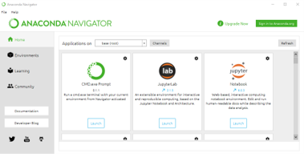
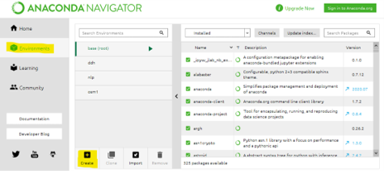
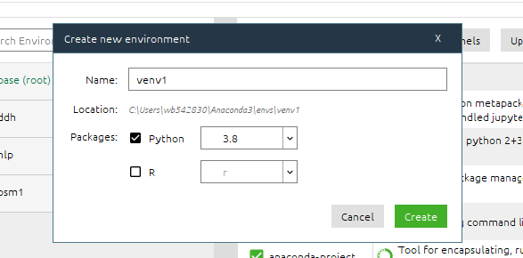
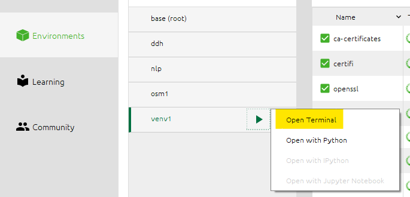

# Installing Python on your computer: the Anaconda distribution

### STEP 1:

Visit [this link](https://www.anaconda.com/products/individual-b) and down Anaconda for Windows/Mac

### STEP 2:

For Windows users, right click on .exe file and click on "Run as Administrator". Installation steps are pretty standard, please keep clicking on Next.

### STEP 3:

Once the installation is complete, navigate to Anaconda on start menu and open the application.

### STEP 4:

Now click on the Environments tab on the left of the application. Now click on "Create" at lower left corner of the application.

### STEP 5:

On the window that pops up, enter the name for virtual environment. (example here uses venv1) and click on Create.

### STEP 6:

Once the virtual environment is created, click on the green triangle (like a play button) and click on Open Terminal.

### STEP 7:

On terminal window, type "pip install pandas" and hit Enter. This will start installation process for pandas package.

### STEP 8:

Now for the final installation, on the left panel, click on Home. On this page, find "Jupyter Notebook" application and click on "Install" right below it.

### STEP 9:

After this installation, you're ready to use Jupyter Notebook. Click on "Launch" and another window will open with Jupyter Notbook server. You can now click on folder to navigate to your ".ipynb" file and open it. Or click on "New" on right top corner to create a new notebook.

### STEP 10:

In the notebook, type "import pandas as pd". If the command ran successfully, the kernel icon will turn from grey to white. You are now ready to code!!

